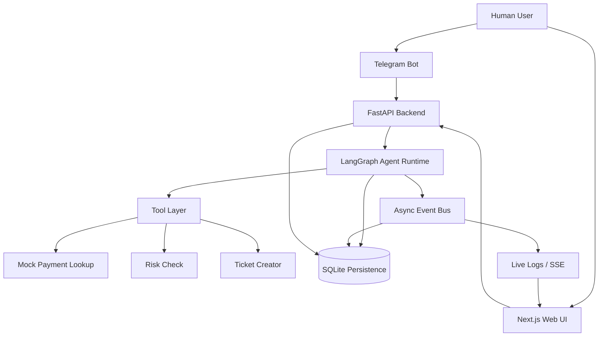

# Ganesh AgentOps — AI Agent Orchestration Platform

> **Ganesh AgentOps — AI Engineer Challenge** · Ganesh Lande
>
> A production-grade multi-agent orchestration platform that investigates payment failures, routes work through a configurable agent pipeline, surfaces every step in a real-time dashboard, and optionally accepts queries from a Telegram bot.

---

**Demo Video:** _\<insert link\>_

---

## Table of Contents

1. [Problem Statement](#problem-statement)
2. [Architecture Overview](#architecture-overview)
3. [Why LangGraph](#why-langgraph)
4. [Tech Stack](#tech-stack)
5. [Features Implemented](#features-implemented)
6. [Local Setup](#local-setup)
7. [Environment Variables](#environment-variables)
8. [Telegram Integration](#telegram-integration)
9. [Demo Workflow](#demo-workflow)
10. [API Overview](#api-overview)
11. [Data Model](#data-model)
12. [Testing](#testing)
13. [Extending the System](#extending-the-system)
14. [Tradeoffs & Assumptions](#tradeoffs--assumptions)
15. [Future Improvements](#future-improvements)

---

## Problem Statement

Payment platforms deal with failed transactions at scale. Manually triaging every decline code, routing fraud signals to compliance, and producing a customer-facing resolution is slow and error-prone.

This project implements a **multi-agent orchestration platform** where:

- Configurable AI agents are wired into a **directed workflow graph**
- Incoming payment issues (via web UI or Telegram) are routed through a 4-agent pipeline: **Intake → Investigator → Risk & Compliance → Resolution**
- Every agent action, tool call, and message is persisted and streamed live to the run monitor
- The system works entirely with a **deterministic mock LLM** — no API keys required to demo — and upgrades to real Claude/GPT models when keys are supplied

---

## Architecture Overview



### Component Responsibilities

| Component | Role |
|---|---|
| **Next.js UI** | Dashboard, agent/workflow/run management pages, React Flow canvas, real-time run monitor via SSE |
| **FastAPI Backend** | REST API, background task execution, SSE streaming, dependency injection, CORS |
| **LangGraph Runtime** | Builds and executes the agent graph; resolves nodes from DB, applies guardrails, tracks tokens |
| **Fallback Graph** | Pure-Python `StateGraph` that mirrors the LangGraph API — runs without `langgraph` installed |
| **Tool Layer** | Registry of 18+ deterministic mock tools (payment_lookup, risk_check, ticket_creator, …) |
| **Event Bus** | In-process, thread-safe store that publishes `RunEvent` objects during execution; consumed by SSE |
| **SQLite + SQLAlchemy** | Persists agents, workflows, runs, messages, and runtime logs with full audit trail |
| **Telegram Bot** | Long-poll integration that accepts free-text payment queries, triggers the PFI workflow, and replies with a structured investigation report |

---

## Why LangGraph

LangGraph was chosen over CrewAI and AutoGen for three reasons:

1. **Explicit graph structure.** Every agent is a named node; every routing decision is a named edge or conditional function. The workflow is code you can read, test, and modify — not an opaque framework loop.

2. **State-first design.** A typed `WorkflowState` dict threads through every node. Agents append to it, conditionals read from it, and the full state is inspectable at any point. This makes fraud-detection routing (`fraud_detected → Risk & Compliance`), confidence-gated paths, and parallel fan-outs natural to express.

3. **Conditional routing and cycles.** The PFI workflow has a fork: non-fraud cases skip Risk & Compliance and go directly to Resolution. LangGraph's `add_conditional_edges` expresses this in four lines, while CrewAI would require custom orchestration code.

The project ships a **zero-dependency fallback** (`app/runtime/fallback_graph.py`) that mirrors the LangGraph `StateGraph` API and passes the same test suite, so the platform works on any Python environment regardless of whether LangGraph is installed.

---

## Tech Stack

| Layer | Technology | Version |
|---|---|---|
| Backend framework | FastAPI + Uvicorn | 0.115 / 0.32 |
| Agent runtime | LangGraph (optional) + fallback | 0.2 |
| ORM + migrations | SQLAlchemy + Alembic | 2.0 / 1.14 |
| Database | SQLite (default) | — |
| Validation | Pydantic v2 + pydantic-settings | 2.10 |
| HTTP client | httpx | 0.28 |
| Frontend | Next.js 14 App Router + TypeScript | 14.2 |
| Graph canvas | @xyflow/react (React Flow) | 12.3 |
| Styling | Tailwind CSS | 3.4 |
| Icons | Lucide React | 0.447 |
| Containers | Docker Compose | — |
| Testing | pytest + pytest-asyncio | 8.3 / 0.24 |

---

## Features Implemented

### Backend
- [x] FastAPI application with lifespan hooks, CORS, and auto-generated OpenAPI docs
- [x] Full CRUD for **agents** — name, role, system_prompt, model, tools, channels, memory_enabled, guardrails, limits
- [x] Full CRUD for **workflows** — React Flow–compatible node/edge JSON stored in SQLite
- [x] **Non-blocking run execution** — `POST /run` returns 202 immediately; workflow runs in a FastAPI `BackgroundTask`
- [x] **LangGraph agent executor** with deterministic mock LLM fallback (no API key needed)
- [x] 4 pre-built agents: Support Intake, Payment Investigator, Risk & Compliance, Resolution
- [x] 2 pre-built workflow templates: Payment Failure Investigation, Merchant Onboarding Review
- [x] 18+ mock tools: payment_lookup, risk_check, ticket_creator, customer_lookup, kyc_lookup, sanctions_checker, refund_initiator, email_sender, …
- [x] **Guardrails system** — per-agent content filtering (blocked topics, max response length, tone enforcement)
- [x] **Cost tracker** — per-agent, per-model token usage and USD cost estimation
- [x] **In-process event bus** — thread-safe, sequential `RunEvent` store per run
- [x] **SSE streaming** — `/api/runs/{id}/events` replays stored events and streams live ones (150 ms poll, 180 s timeout, heartbeat)
- [x] Persisted runtime logs with level + event_type filtering
- [x] Persisted agent-to-agent messages with channel and sender/receiver metadata
- [x] **Telegram bot integration** — long-poll, `/demo` command, free-text payment queries, structured HTML reply

### Frontend
- [x] Dashboard with stats (agents, workflows, runs, tokens, cost) and one-click **Run Payment Failure Demo** button
- [x] `/agents` — table with edit/delete, right-side slide panel for full CRUD
- [x] `/workflows` — split-pane layout: sidebar list + React Flow canvas; **Edit Info**, **Edit JSON**, **Run** panels
- [x] `/templates` — two template cards with pipeline preview, "Create Workflow" and "Run Demo" buttons
- [x] `/runs` — clickable run list with auto-refresh for live runs
- [x] `/runs/[id]` — **run monitor** with SSE live event feed, agent pipeline status strip, message timeline, tool executions, per-agent token bars, runtime logs

### Testing
- [x] 226 tests across 11 test files
- [x] Isolated SQLite test databases (no production data touched)
- [x] All tests pass with zero API keys

---

## Local Setup

### With Docker (recommended)

```bash
git clone <repo>
cd ganesh-agentops

# Copy and configure environment
cp .env.example .env
# Minimum required: nothing (mock LLM works out of the box)

# Start backend + frontend
docker compose up --build
```

| URL | Service |
|---|---|
| `http://localhost:3000` | Web UI |
| `http://localhost:8000` | Backend API |
| `http://localhost:8000/docs` | Swagger UI |
| `http://localhost:8000/redoc` | ReDoc |

### Without Docker

**Backend**
```bash
cd backend
python -m venv .venv
source .venv/bin/activate        # Windows: .venv\Scripts\activate
pip install -r requirements.txt
uvicorn app.main:app --reload --port 8000
```

**Frontend** (requires Node ≥ 18.17)
```bash
cd frontend
npm install
npm run dev                      # http://localhost:3000
```

---

## Environment Variables

Copy `.env.example` to `.env` in the project root. Every variable is optional for the mock demo.

```ini
# ── Application ───────────────────────────────────��────────
APP_NAME=Ganesh AgentOps
DEBUG=true

# ── Database ───────────────────────────────────────────────
DATABASE_URL=sqlite:///./data/agentops.db

# ── CORS ───────────────────────────────────────────────────
CORS_ORIGINS=["http://localhost:3000"]

# ── AI Provider keys (optional — mock LLM used when absent) ─
ANTHROPIC_API_KEY=           # Enables Claude Sonnet/Opus/Haiku
OPENAI_API_KEY=              # Enables GPT-4o / GPT-4o-mini

# ── Telegram (optional) ────────────────────────────────────
TELEGRAM_BOT_TOKEN=          # Leave blank to disable bot
TELEGRAM_CHAT_ID=            # Optional: startup ping / restrict access
TELEGRAM_SKIP_SSL_VERIFY=false   # Set true on dev machines with proxy SSL issues
```

### Behaviour without keys

| Variable absent | Effect |
|---|---|
| `ANTHROPIC_API_KEY` | Runtime uses `MockLLM` — deterministic responses, no cost |
| `OPENAI_API_KEY` | Same as above |
| `TELEGRAM_BOT_TOKEN` | Bot disabled; backend starts normally; `/api/telegram/status` returns `{"enabled": false}` |

---

## Telegram Integration

### 1 — Create a bot with BotFather

```
1. Open Telegram → search @BotFather
2. Send /newbot
3. Choose a display name (e.g. "Ganesh AgentOps")
4. Choose a username ending in _bot (e.g. ganesh_agentops_bot)
5. Copy the token BotFather returns
```

### 2 — Find your Chat ID (optional)

```
1. Send /start to your new bot
2. Visit: https://api.telegram.org/bot<TOKEN>/getUpdates
3. Look for "chat": {"id": 123456789} in the response
```

### 3 — Configure and restart

```ini
# .env
TELEGRAM_BOT_TOKEN=1234567890:ABCDefghIJKlmnoPQRstuvwXYZ
TELEGRAM_CHAT_ID=123456789
```

```bash
docker compose restart backend
# or: uvicorn app.main:app --reload
```

### 4 — Supported commands

| Message | Action |
|---|---|
| `/start` or `/help` | Welcome message with usage guide |
| `/demo` | Runs Payment Failure Investigation for `PAY-10291` |
| Any text containing `PAY-XXXXX` | Triggers investigation for that payment ID |
| Any free-form text | Treated as a payment investigation request |

### 5 — Example Telegram reply

```
✅ Payment Investigation Complete

💳 Payment ID: PAY-10291
🚫 Failure: Card Declined
🏦 Failure Owner: Issuing Bank
🟡 Risk Level: LOW — Issuing bank issue (no fraud)
🎯 Recommended Action: Advise customer to retry with a different card
      or contact their issuing bank.
🎫 Support Ticket: TKT-47271
📊 Confidence: 95%

🔗 Run ID: #9 — view full details in the AgentOps UI
⚡ 1,465 tokens consumed
```

Both the inbound message and the outbound reply are persisted to the database with `channel="telegram"` and appear in the run monitor UI.

---

## Demo Workflow

### Option A — Web UI (no configuration required)

1. Open `http://localhost:3000`
2. Click **"Run Payment Failure Demo"** on the Dashboard
3. Navigate to `/runs` — the new run appears with a live spinner
4. Click the run to open the **Run Monitor**:
   - Watch the **Agent Pipeline** strip light up as each agent completes
   - The **Event Stream** panel scrolls through live SSE events
   - **Message Timeline** shows each agent's response with markdown rendering
   - **Tools Executed** shows `ticket_creator` and `payment_lookup` calls with args + results
   - **Token Usage** shows per-agent input/output breakdown

### Option B — Telegram

```
You → Bot: PAY-10291 failed, please investigate
Bot → You: ✅ Payment Investigation Complete …
```

The run also appears in the web UI at `/runs`.

### Option C — Direct API

```bash
# Trigger a run
curl -X POST http://localhost:8000/api/workflows/1/run \
  -H "Content-Type: application/json" \
  -d '{"message": "Payment PAY-10291 failed. Card declined. Please investigate."}'
# Returns: {"run_id": 10, "status": "pending", "events_url": "/api/runs/10/events"}

# Stream live events
curl -N http://localhost:8000/api/runs/10/events

# Poll for final status
curl http://localhost:8000/api/runs/10
```

---

## API Overview

Full interactive docs at `http://localhost:8000/docs`.

### System

| Method | Path | Description |
|---|---|---|
| `GET` | `/health` | Service health + Telegram status |

### Agents

| Method | Path | Description |
|---|---|---|
| `GET` | `/api/agents` | List agents (pagination: skip, limit) |
| `POST` | `/api/agents` | Create agent |
| `GET` | `/api/agents/{id}` | Get agent |
| `PUT` | `/api/agents/{id}` | Partial update (PATCH semantics) |
| `DELETE` | `/api/agents/{id}` | Delete agent |

### Workflows

| Method | Path | Description |
|---|---|---|
| `GET` | `/api/workflows` | List workflows |
| `POST` | `/api/workflows` | Create workflow |
| `GET` | `/api/workflows/{id}` | Get workflow |
| `PUT` | `/api/workflows/{id}` | Update workflow |
| `DELETE` | `/api/workflows/{id}` | Delete workflow |
| `POST` | `/api/workflows/{id}/run` | Trigger run → 202 + `{run_id, events_url, poll_url}` |

### Runs & Monitoring

| Method | Path | Description |
|---|---|---|
| `GET` | `/api/runs` | List runs (filter: workflow_id, status) |
| `GET` | `/api/runs/{id}` | Run detail with counts |
| `GET` | `/api/runs/{id}/messages` | Persisted agent messages |
| `GET` | `/api/runs/{id}/logs` | Runtime logs (filter: level, event_type) |
| `GET` | `/api/runs/{id}/events` | **SSE stream** — live events, replay, heartbeat |

### Templates

| Method | Path | Description |
|---|---|---|
| `GET` | `/api/templates` | List all templates |
| `GET` | `/api/templates/{type}` | Get template definition |
| `POST` | `/api/templates/{type}/create-workflow` | Instantiate workflow from template |

### Messages & Telegram

| Method | Path | Description |
|---|---|---|
| `GET` | `/api/messages` | Query messages (filter: run_id, agent, channel) |
| `GET` | `/api/telegram/status` | Bot enabled/connected state |
| `POST` | `/api/telegram/send` | Send ad-hoc message via bot |

---

## Data Model

```
┌──────────────┐       ┌─────────────────┐       ┌──────────────┐
│   agents     │       │   workflows      │       │ workflow_runs │
│──────────────│       │─────────────────│       │──────────────│
│ id (PK)      │       │ id (PK)          │  1:N  │ id (PK)      │
│ name         │       │ name             │◄──────│ workflow_id  │
│ role         │       │ description      │       │ status       │
│ system_prompt│       │ nodes (JSON)     │       │ input_payload│
│ model        │       │ edges (JSON)     │       │ output_payload│
│ tools (JSON) │       │ template_type    │       │ total_tokens │
│ channels(JSON│       │ created_at       │       │ estimated_cost│
│ memory_enabled       │ updated_at       │       │ started_at   │
│ guardrails   │       └─────────────────┘       │ completed_at │
│ limits (JSON)│                                  └──────┬───────┘
│ created_at   │                                         │ 1:N
│ updated_at   │              ┌──────────────┐           │
└──────────────┘              │   messages   │◄──────────┤
                              │──────────────│           │ 1:N
                              │ id (PK)      │    ┌──────▼──────┐
                              │ run_id (FK)  │    │runtime_logs │
                              │ sender_agent │    │─────────────│
                              │ receiver_agent    │ id (PK)     │
                              │ channel      │    │ run_id (FK) │
                              │ message_type │    │ level       │
                              │ content      │    │ event_type  │
                              │ created_at   │    │ message     │
                              └──────────────┘    │ log_metadata│
                                                  │ created_at  │
                                                  └─────────────┘
```

### Key design decisions

- **nodes/edges stored as JSON** in the `workflows` table — they follow the React Flow schema exactly, so the frontend renders them without transformation
- **messages** support `channel="telegram"` alongside `"internal"`, making multi-channel delivery a first-class concern
- **output_payload** on runs is a JSON blob containing `final_output`, `agent_outputs`, `extracted_data`, and `cost_summary` — richer than a flat status field
- **runtime_logs** are separate from messages: logs are operational telemetry (agent_start, tool_call, agent_end), messages are business content

---

## Testing

### Run all tests

```bash
cd backend
pytest                               # 226 tests, ~5 min
pytest -v                            # verbose with test names
pytest --tb=short                    # short tracebacks on failure
```

### Run a specific suite

```bash
pytest app/tests/                                    # focused suite (127 tests)
pytest tests/                                        # original suite (99 tests)
pytest app/tests/test_workflow_execution.py -v       # workflow execution
pytest app/tests/test_tools.py::TestPaymentLookup    # single class
```

### Test suites

| File | Tests | What it covers |
|---|---|---|
| `app/tests/test_agent_crud.py` | 37 | Create/retrieve agents; tools, channels, guardrails, limits field persistence |
| `app/tests/test_workflow_execution.py` | 30 | PFI + Merchant Onboarding pipelines; ≥2 agents execute; tool calls; token counts |
| `app/tests/test_message_delivery.py` | 25 | Persistence, sender/receiver, run linkage, cross-run isolation, channel routing |
| `app/tests/test_tools.py` | 35 | `payment_lookup` determinism, `risk_check` scoring, `ticket_creator` TKT- prefix |
| `tests/test_agents_api.py` | 17 | Full CRUD via HTTP, 409 on duplicate name |
| `tests/test_workflows_api.py` | 18 | CRUD + `/run` 202 Accepted |
| `tests/test_runs_api.py` | 22 | List/get, messages, logs, SSE frames |
| `tests/test_templates_api.py` | 15 | List, get, create-from-template |
| `tests/test_runtime.py` | 20 | MockLLM, CostTracker, Guardrails, FallbackGraph, full PFI integration |
| `tests/test_db.py` | 4 | `init_db` idempotency |
| `tests/test_health.py` | 3 | `/health` response shape |

> All tests use an **isolated SQLite database** (`data/app_tests.db` or `data/test_agentops.db`) that is created and destroyed per session. No API keys required.

---

## Extending the System

### Add a new agent

1. Add an entry to `backend/app/seed/seed_data.py` → `DEFAULT_AGENTS` list with `name`, `role`, `system_prompt`, `model`, `tools`, `channels`, `guardrails`, and `limits`.
2. Restart the backend — `seed_agents()` is idempotent and will insert the new record on first startup.
3. To wire the agent into a workflow, reference it by name in a node's `data.agent_name` field.

```python
# Example — backend/app/seed/seed_data.py
{
    "name": "Fraud Specialist Agent",
    "role": "Fraud Detection Analyst",
    "system_prompt": "You detect payment fraud patterns…",
    "model": "claude-sonnet-4-6",
    "tools": ["fraud_signal_check", "sanctions_checker"],
    "channels": ["internal"],
    "memory_enabled": True,
    "guardrails": {"block_topics": ["evasion_techniques"]},
    "limits": {"max_iterations": 10, "timeout_seconds": 60},
}
```

### Add a new workflow template

1. Add a new key to `WORKFLOW_TEMPLATES` in `backend/app/seed/workflow_templates.py`.
2. Define `template_type`, `name`, `description`, `agents`, `tools`, `nodes`, and `edges` following the React Flow schema.
3. Add static metadata (icon, purpose, sample input) to `TEMPLATE_META` in `frontend/app/templates/page.tsx`.

```python
# backend/app/seed/workflow_templates.py
"fraud_investigation": {
    "template_type": "fraud_investigation",
    "name": "Fraud Investigation",
    "description": "…",
    "agents": ["Support Intake Agent", "Fraud Specialist Agent", "Resolution Agent"],
    "tools": ["fraud_signal_check", "sanctions_checker"],
    "nodes": [
        {"id": "node-intake", "type": "agentNode",
         "position": {"x": 50, "y": 200},
         "data": {"label": "Intake", "agent_name": "Support Intake Agent", "color": "#3b82f6"}},
        # …
    ],
    "edges": [
        {"id": "e1", "source": "node-intake", "target": "node-fraud",
         "label": "escalate_fraud", "animated": True},
        # …
    ],
}
```

The template automatically appears in `GET /api/templates` and on the Templates page.

### Add a new messaging channel (e.g. Slack)

1. **Create the adapter** — `backend/app/integrations/slack_bot.py`, modelled on `telegram_bot.py`:
   - Implement `start()`, `stop()`, `status()` methods
   - On incoming message → call `_execute_workflow_sync()` → call `_persist_outbound()`
   - Set `channel="slack"` in all `persist_message()` calls

2. **Wire into lifespan** — add to `backend/app/main.py` lifespan alongside the Telegram block:
   ```python
   if settings.SLACK_BOT_TOKEN:
       slack_bot = SlackBot(settings.SLACK_BOT_TOKEN, SessionLocal)
       app.state.slack_bot = slack_bot
       await slack_bot.start()
   ```

3. **Add a status endpoint** — `backend/app/api/slack.py` following `api/telegram.py`.

4. **Add env vars** — `SLACK_BOT_TOKEN` in `config.py` and `.env.example`.

5. **Frontend visibility** — the channel tag `slack` appears automatically in message lists because the UI renders `channel` as a badge with no hardcoded list.

---

## Tradeoffs & Assumptions

| Decision | Rationale | Limitation |
|---|---|---|
| **SQLite over PostgreSQL** | Zero-infrastructure setup; perfect for local demo and evaluation | Not suitable for concurrent writes at scale; swap `DATABASE_URL` to swap engines |
| **Mock LLM as default** | Deterministic responses mean tests are fast and reproducible without API keys | Responses are scripted, not semantically generated; swap `_get_llm()` in `graph_builder.py` to use real models |
| **In-process event bus** | No external dependency (Redis, Kafka) for the demo; events are immediately available for SSE | Bus lives in RAM — events are lost on server restart; completed runs fall back to the persisted log API |
| **Long-poll Telegram** | Simpler than webhook setup (no public URL, no ngrok required) | Slightly higher latency than webhooks; not suitable for high-message-volume production bots |
| **Background tasks via FastAPI `BackgroundTasks`** | Simple, no queue dependency | Single-process; cannot fan out across workers; replace with Celery/Redis for horizontal scaling |
| **Synchronous agent runtime** | Easier to reason about and test; deterministic execution order | Agents run sequentially in the thread pool; parallel branches are simulated, not truly concurrent |
| **React Flow positions in DB** | Frontend renders graphs without transformation | Node layout is fixed at workflow creation; drag-to-reposition changes are not auto-saved |
| **No authentication** | Evaluation focus is on agent orchestration, not auth infrastructure | Every endpoint is publicly accessible; add OAuth2/JWT before any production deployment |

---

## Future Improvements

These are known gaps, not missing bugs. Prioritised for a production path:

| Priority | Improvement |
|---|---|
| P0 | **Authentication & RBAC** — JWT-based auth, role-gated endpoints (`viewer`, `operator`, `admin`) |
| P0 | **PostgreSQL** — swap `DATABASE_URL`; add Alembic migration history |
| P0 | **Redis-backed task queue** — replace FastAPI `BackgroundTasks` with Celery + Redis for horizontal scaling and retries |
| P1 | **Human-in-the-loop approvals** — pause graph execution, surface pending decisions in UI, resume on approval |
| P1 | **Retry / dead-letter queue** — failed workflow runs are logged but not retried; add exponential backoff |
| P1 | **OpenTelemetry** — distributed tracing across agent nodes; replace custom logging with OTEL spans |
| P1 | **Webhook mode for Telegram** — replace long-poll with webhook + ngrok/Cloudflare Tunnel for lower latency |
| P2 | **Slack & WhatsApp adapters** — follow the channel extension guide above |
| P2 | **Real payment provider integrations** — replace mock `payment_lookup` with Stripe/Adyen/Braintree API clients |
| P2 | **Budget controls** — per-run token cap, cost alerts, global spend limits |
| P2 | **Multi-tenant workspaces** — isolate agents, workflows, and runs by organisation |
| P3 | **Workflow version history** — immutable workflow snapshots so past runs are always reproducible |
| P3 | **Agent memory store** — persistent cross-session memory (pgvector or LangChain memory) |
| P3 | **Live workflow canvas editing** — drag-drop node creation and edge drawing in React Flow with auto-save |

---

## Project Structure

```
ganesh-agentops/
├── .env.example                    # All supported environment variables
├── docker-compose.yml              # Backend + frontend orchestration
├── backend/
│   ├── requirements.txt
│   ├── pytest.ini                  # testpaths = tests app/tests
│   └── app/
│       ├── main.py                 # FastAPI app, lifespan, Telegram startup
│       ├── config.py               # Pydantic settings (all env-driven)
│       ├── database.py             # Engine, SessionLocal, init_db
│       ├── models/                 # SQLAlchemy ORM models
│       │   ├── agent.py
│       │   ├── workflow.py
│       │   ├── workflow_run.py
│       │   ├── message.py
│       │   └── runtime_log.py
│       ├── schemas/                # Pydantic request/response schemas
│       ├── api/                    # Route handlers
│       │   ├── agents.py
│       │   ├── workflows.py        # includes /run (BackgroundTask)
│       │   ├── runs.py             # includes SSE /events
│       │   ├── templates.py
│       │   ├── messages.py
│       │   └── telegram.py         # /status + /send
│       ├── runtime/
│       │   ├── agent_runtime.py    # Orchestrates full run lifecycle
│       │   ├── graph_builder.py    # LangGraph graph + MockLLM
│       │   ├── fallback_graph.py   # Zero-dependency StateGraph
│       │   ├── event_bus.py        # Thread-safe RunEvent store
│       │   ├── cost_tracker.py     # Per-agent token + USD tracking
│       │   ├── guardrails.py       # Content filtering
│       │   └── memory.py           # persist_message / persist_log helpers
│       ├── tools/
│       │   └── registry.py         # 18+ mock tool implementations
│       ├── integrations/
│       │   └── telegram_bot.py     # Long-poll bot, workflow trigger, reply formatting
│       ├── seed/
│       │   ├── seed_data.py        # 4 default agents
│       │   └── workflow_templates.py  # PFI + Merchant Onboarding templates
│       └── tests/                  # Focused test suite (127 tests)
│           ├── conftest.py
│           ├── test_agent_crud.py
│           ├── test_workflow_execution.py
│           ├── test_message_delivery.py
│           └── test_tools.py
├── tests/                          # Original API test suite (99 tests)
│   ├── conftest.py
│   ├── test_agents_api.py
│   ├── test_workflows_api.py
│   ├── test_runs_api.py
│   ├── test_templates_api.py
│   ├── test_runtime.py
│   ├── test_db.py
│   └── test_health.py
└── frontend/
    ├── package.json
    ├── next.config.js
    ├── tailwind.config.ts
    └── app/
        ├── layout.tsx              # Navigation sidebar + main wrapper
        ├── page.tsx                # Dashboard (stats + demo button)
        ├── agents/page.tsx         # Agent CRUD with slide panel
        ├── workflows/page.tsx      # React Flow canvas + run trigger
        ├── templates/page.tsx      # Template cards + pipeline preview
        ├── runs/page.tsx           # Run list with auto-refresh
        └── runs/[run_id]/page.tsx  # Run monitor (SSE + timeline)
```

---

*Ganesh AgentOps — AI Engineer Challenge · Ganesh Lande · ganeshlande@gmail.com*
